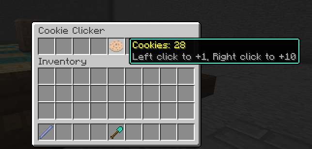

# Jaksara Inventory

> A type-safe Kotlin DSL for creating Paper inventory GUIs.

[](https://central.sonatype.com/artifact/io.github.trainingbear/jaksara-inventory)
[](LICENSE)
[](https://github.com/TrainingBear/jaksara-inventory)


---

A lightweight Kotlin-first inventory menu framework for Bukkit/Spigot plugins. It provides a Kotlin DSL and Java-friendly APIs to build interactive GUIs (menus) with clickable buttons, paginators, and helper ExecutionContext utilities.
# Installation

Requirements

- PaperMC API: 1.20.1 or newer

Gradle (Kotlin DSL)
```kotlin
dependencies {
    implementation("io.github.trainingbear:jaksara-inventory:<version>") 
}
```

Gradle (Groovy)
```groovy
dependencies {
    implementation 'io.github.trainingbear:jaksara-inventory:<version>'
}
```

Maven
```xml
<dependency>
  <groupId>io.github.trainingbear</groupId>
  <artifactId>jaksara-inventory</artifactId>
  <version>version</version>
</dependency>
```

# Plugin Setup

Call `CustomMenu.init(plugin)` in your plugin `onEnable()` to register internal listeners (Inventory & Chat).

```java
public class MyPlugin extends JavaPlugin {
  public void onEnable() {
    CustomMenu.init(this);
  }
}
```


# Quick Cookie Clicker example (Kotlin DSL + Java)

```kotlin
val menu = CustomMenu.createMenu("Cookie Clicker", plugin) {
    var cookies = 0
    // 1 row (9 slots)
    layout(0, 0, 0, 0, 1, 0, 0, 0, 0)

    // id 1 occupies slot(s) associated with layout id 1
    button(1) {
        material(Material.COOKIE)
        title { "<yellow>Cookies: $cookies" }
        lore("<gray>Left click to +1, Right click to +10")

        onClick {
            cookies += if (invClickEvent.isLeftClick) 1 else 10
            refresh() // update display
        }
    }
}

menu.open(player)
```

Java equivalent (simple)

```java
fun createMenu(player Player) {
    InventoryMenuDsl menu = CustomMenu.createMenu("Cookie Clicker", plugin);
    int cookie = 0;
    menu.layout(0, 0, 0, 0, 1, 0, 0, 0, 0);
    menu.button(0, b -> {
        b.material(Material.COOKIE);
        b.title(() -> "<yellow>Cookies: "+cookie);
        b.lore("<gray>Left click to +1, Right click to +10");
        b.onClick(ctx -> {
            // update state and refresh; use player-specific storage when needed
            cookies += invClickEvent.isLeftClick ? 1 : 10;
            ctx.refresh();
        });
    });
    menu.open(player);
}
```

# Pagination Menu Example (Kotlin DSL)
```kotlin
fun createMenu(player: Player, plugin: Plugin) {
    val menu = CustomMenu.createMenu("<bold>Pagination Demo", plugin) {
        layout(
            // desired layout contains id with size 5x9
            0, 0, 1, 1, 0, 1, 1, 0, 0,
            0, 1, 1, 1, 1, 1, 1, 1, 0,
            0, 0, 1, 1, 1, 1, 1, 0, 0,
            0, 0, 0, 0, 1, 0, 0, 0, 0,
            0, 0, 0, 2, 0, 3, 0, 0, 0,
        )
        // replace every slot with id 0 to a decorative border
        border(0, Material.GRAY_STAINED_GLASS_PANE)
        val content = mutableListOf<ClickableButton>()
        for (i in 1..100) { // create a random content with size 100
            content += CustomMenu.createButton {
                material(getRandomMaterial())
                title("<green>Item number: <white>$i")
                onClick {
                    // click callback
                    player.sendMessage("This is material number $i")
                }
            }
        }
        // replace every slot with id to target content
        fill(1, content)

        // create a navigation button
        button(2) { // prev button
            material(Material.ARROW)
            title("<green>Open Previous Page")
            onClick {
                // get button with id 1, then open previous page
                getButton(1).openPrevPage()
            }
        }

        button(3) { // next button
            material(Material.ARROW)
            title("<green>Open Next Page")
            onClick {
                getButton(1).openNextPage()
            }
        }
    }

    menu.open(player)
}
```

Java equivalent (simple)
```java
public void createMenu(Player player, Plugin plugin) {
    val menu = CustomMenu.createMenu("<bold>Pagination Demo", plugin);
    menu.layout(
            // desired layout contains id with size 5x9
            0, 0, 1, 1, 0, 1, 1, 0, 0,
            0, 1, 1, 1, 1, 1, 1, 1, 0,
            0, 0, 1, 1, 1, 1, 1, 0, 0,
            0, 0, 0, 0, 1, 0, 0, 0, 0,
            0, 0, 0, 2, 0, 3, 0, 0, 0
    );
    // replace every slot with id 0 to a decorative border
    menu.border(0, Material.GRAY_STAINED_GLASS_PANE);
    List<ClickableButton> content = ArrayList();
    for (int i; i <= 100; i++) { // create a random content with size 100
        ClickableButton button = CustomMenu.createButton();
        button.material(getRandomMaterial());
        button.title("<green>Item number: <white>$i");
        // add click callback 
        button.onClick (ctx -> ctx.player.sendMessage("This is material number " + i));
        content.add(button);
    }
    // replace every slot with id to target content
    menu.fill(1, content);

    // create a navigation button
    menu.button(2, button -> {  // prev button
        button.material(Material.ARROW);
        button.title("<green>Open Previous Page");
        // get button with id 1, then open previous page
        button.onClick(ctx -> ctx.getButton(1).openPrevPage());
    });

    menu.button(3, button -> {  // next button
        button.material(Material.ARROW);
        button.title("<green>Open Next Page");
        button.onClick(ctx -> getButton(1).openNextPage());
    });


    menu.open(player);
}
```

# Option Menu Example (Kotlin DSL)
```kotlin
    val menu = CustomMenu.createMenu("<bold>Option Button Demo", plugin) {
        layout(
            0, 0, 0, 0, 1, 0, 0, 0, 0,
        )
        val options = ArrayList<String>()
        for (i in 1..10) { // create an option with size 10
            options.add("Option number $i")
        }

        // replace id 1 with option button
        optionButton(
            1,
            Material.PAPER,
            "<green>Choose Your Option",
            listOf("<gray>please choose your option in range 1 to 10"),
            options,
            0 // index default option, in this case options[0]
        ) { ctx, selectedOption ->
            // add click callback
            ctx.player.sendMessage("You choose $selectedOption")
        }
    }
    menu.open(player)

```

# Option Menu Example (Kotlin DSL)
```kotlin
    val menu = CustomMenu.createMenu("<bold>List Button Demo", plugin) {
        layout(
            0, 0, 0, 0, 1, 0, 0, 0, 0,
        )
        // create an initial list (this can be zero)
        val list = ArrayList<String>()
        list.add("KuJaTic")
        list.add("Kukuh Sudrajad")
        list.add("JitteryAttic")

        // replace id 1 with list button
        listButton(
            1,
            Material.PAPER,
            "<green>Jaksara Author",
            listOf("<gray>Custom Menu library author"),
            list
        ) { ctx, updatedList -> // add click callback

            // we can use lambda updatedList parameter
            ctx.player.sendMessage("<Lambda> You just added ${updatedList.last()}")

            // or we can use our last mutable list reference
            ctx.player.sendMessage("<List> You just added ${list.last()}")
        }
    }

    menu.open(player)
```

See docs/ for full usage, API reference and more examples (Kotlin + Java).
