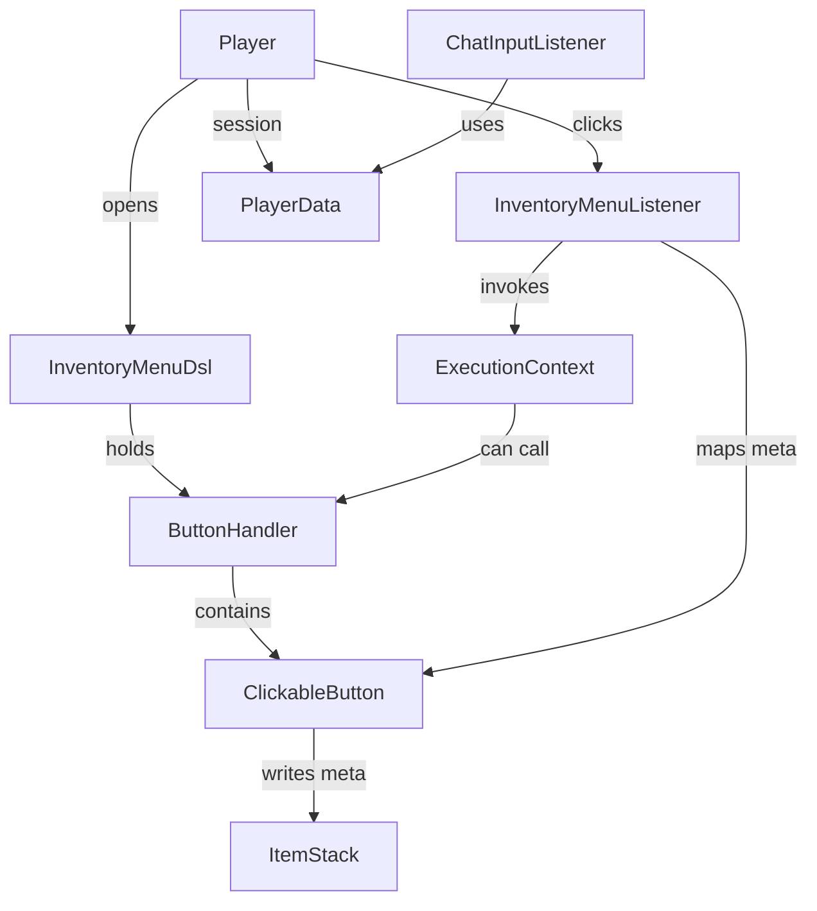

# Architecture

The library is intentionally small. Core runtime pieces:

- Menu (InventoryMenuDsl)
- Session (PlayerData cache)
- Listener (InventoryMenuListener & ChatInputListener)
- Button (ClickableButton & ButtonHandler)
- ExecutionContext (callback runtime)

Mermaid diagram

Notes

- Persistent item metadata (NamespacedKey derived from menu title) is used to map ItemStacks to ClickableButton instances so that InventoryClickEvent handlers can find the correct executor.
- Per-player inventory cache allows independent menu instances per player.
